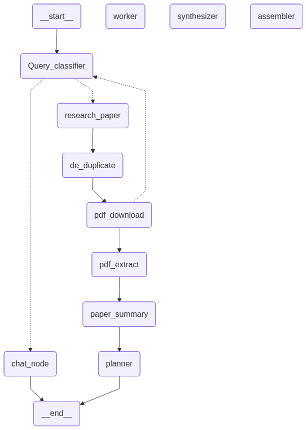

# Autonomous Literature Review Agent System

A multi-agent system that takes a research question and produces a
structured, citation-grounded literature review — searching for papers,
extracting their content, summarizing them, and dispatching parallel
analyst agents to compare findings before synthesizing a final report.

## Motivation

This came out of a real need from my own research work. Doing a proper
literature review by hand — finding papers, reading each one, pulling out
comparable data, writing up what's been done and what's missing — took
days per topic. This system automates that: retrieval, structured
extraction, and cross-paper comparison, so I can focus on the actual
analysis instead of the grunt work.

## Architecture



*Note: LangGraph's auto-renderer can't draw dynamic `Send()` fan-out edges,
so `worker`, `synthesizer`, and `assembler` appear disconnected above. In
reality, `planner` dispatches N parallel `worker` agents, which feed into
`synthesizer` → `assembler`.*

**Orchestration pattern:** Pipeline (search → extract → summarize) +
Parallel/Aggregator (planner fans out to workers, synthesizer aggregates).

| Agent | Role |
|---|---|
| Query Classifier | Routes query to chat or literature review, generates search queries |
| Chat Node | Handles non-research queries |
| Research Paper Search | Queries OpenAlex for open-access papers |
| PDF Downloader / Extractor | Fetches and extracts full-text PDFs |
| Paper Summarizer | Extracts structured data per paper (methods, datasets, results, gaps) |
| Planner (Supervisor) | Designs cross-paper comparison tasks for workers |
| Worker (parallel, ×N) | Writes one comparison section (table + discussion) |
| Synthesizer | Aggregates worker outputs into closing synthesis |
| Assembler | Stitches everything into the final report |

## Tech Stack

LangGraph · LangChain Core · Google Gemini (`gemini-3.1-flash-lite`) ·
OpenAlex API · PyMuPDF · Pydantic

## How to Run

```bash
pip install langgraph langchain-core langchain-google-genai pymupdf requests python-dotenv pydantic
```

Add `GOOGLE_API_KEY=your_key_here` to a `.env` file, set your query in
`main3.py`, then:

```bash
python main3.py
```

Output: `literature_review.md` (final report) and `graph.png` (agent graph).

## Known Limitations

- Only open-access papers with a direct PDF link can be downloaded.
- After 3 failed search rounds, the review proceeds with whatever was found.
- The classifier decides once per query whether research is needed.
